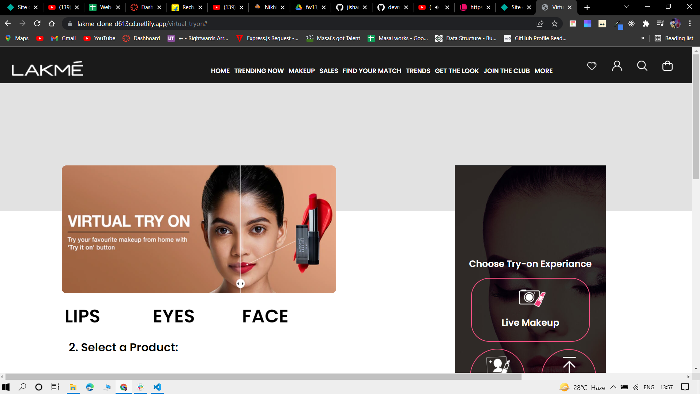
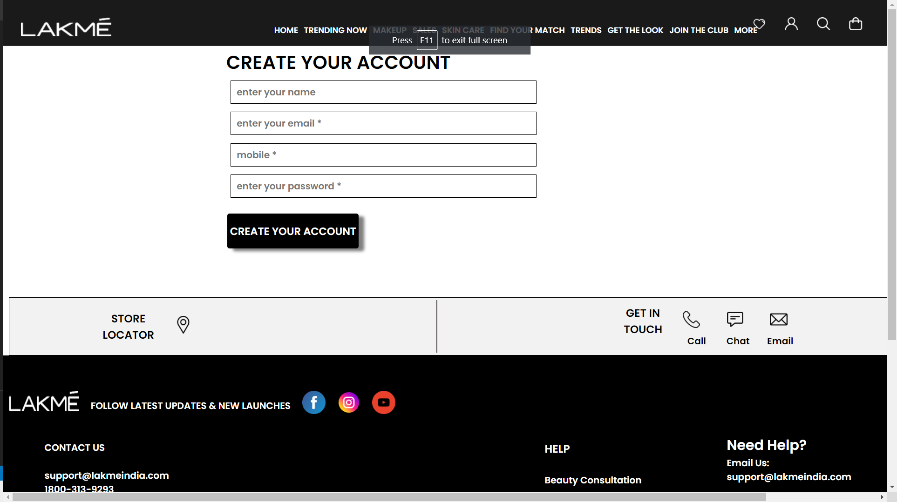
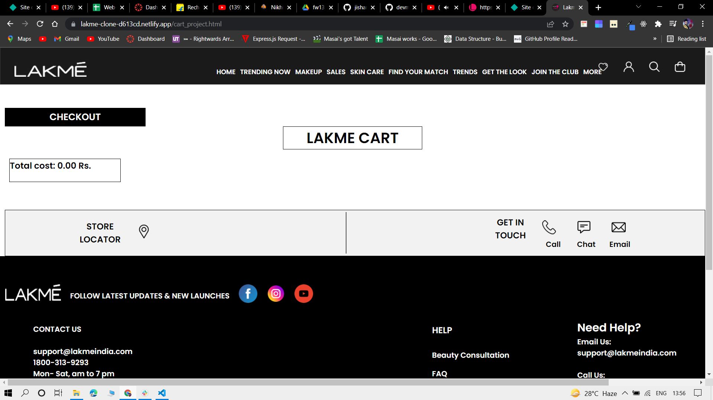

<h1>Lakme Clone</h1>

<h3>We have cloned the Lakme Website <a href="https://lakmeindia.com/" target="_blank">https://lakmeindia.com/</a> . Basically it is a commercial website used to sell cosmetic and beauty products of Lakme.
Here customers can find beauty products of their need and buy them. </h3>

<h2>Stack and Libraries Used</h2>
<ul>
  <li>HTML</li>
  <li>Javascript</li>
  <li>Css</li>
</ul>

  
<h3>Deployment Link</h3>
<a href="https://lakme-clone-d613cd.netlify.app/">https://lakme-clone-d613cd.netlify.app/
</a>

<h2>Sneak Peeks</h2>

Landing Page

Trending Page

Signup Page

Cart Page

 
<h2>Team Members and Contributors</h2>
 
 

<h3>Amruta Banait</h3>
<ul>
  <li>Github: </li>
  <li>Email: </li>
  <li>LinkedIn: </li>
</ul>

 

<h3>Jishan Pathan</h3>
<ul>
  <li>Github: <a href= "https://github.com/jishanpatel7" >jishanpatel7</a></li>
  <li>Email:  jishanpatel78@gmail.com  </li>
  <li>LinkedIn: <a href="https://www.linkedin.com/in/jishan-pathan-5b398b198/">https://www.linkedin.com/in/jishan-pathan-5b398b198/ </a></li>
</ul>

 

<h3>Mohit Gupta</h3>
<ul>
  <li>Github:</li>
  <li>Email: </li>
  <li>LinkedIn: </li>
</ul>

 

<h3>Nikhil Shakya</h3>
<ul>
  <li>Github:  <a href= "https://github.com/devmanush-forEach" >devmanush-forEach</a></li>
  <li>Email:shakyanikhil12345@gmail.com </li>
  <li>LinkedIn: <a href="https://www.linkedin.com/in/nikhil-shakya-3a1939213/">https://www.linkedin.com/in/nikhil-shakya-3a1939213/ </a></li>
</ul>

